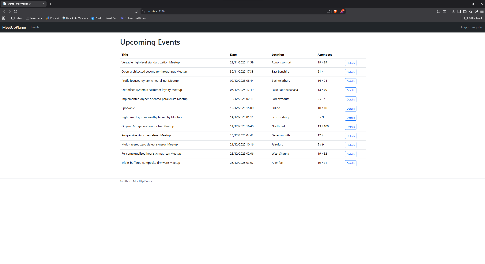
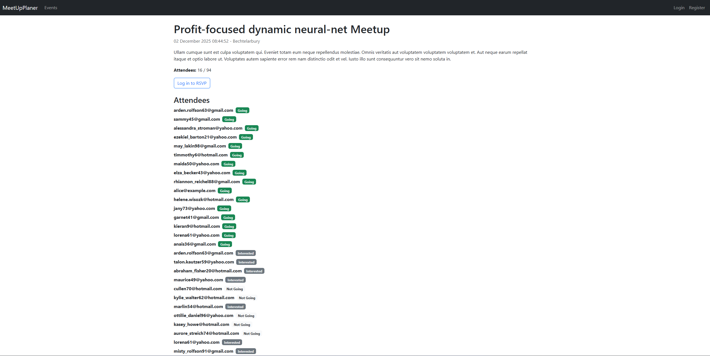

# MeetUpPlaner

A compact demo app (ASP.NET Core Razor Pages) for creating events and managing RSVPs. Built as a concise portfolio piece.

What it does
- Event CRUD with owner-or-admin protections
- RSVP statuses: Going, Interested, Not Going (capacity enforced)
- ASP.NET Identity for auth and roles; service layer for business logic
- Deterministic seeding for quick demos

Demo accounts
- Admin: admin@example.com / P@ssw0rd1
- Demo users: alice@example.com, bob@example.com, charlie@example.com (same password)

Screenshots (place images in docs/screenshots/)
 
 
 

Tech
- .NET 10, EF Core (SQLite), ASP.NET Identity
